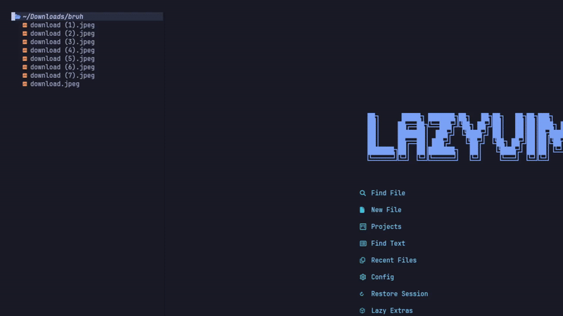

# focal.nvim 👁️

> **Fo**cused **Ca**lm **L**ook for Neovim images.

`focal.nvim` provides an image preview experience for your file explorer. It is designed to be a "set and forget" plugin that just works.



---

## ✨ Features

-   **Zero-Friction Hover**: Automatically previews images when your cursor hovers over them.
-   **Multi-Explorer Support**: Works out of the box with:
    -   `nvim-neo-tree/neo-tree.nvim`
    -   `nvim-tree/nvim-tree.lua`
    -   `stevearc/oil.nvim`
    -   `folke/snacks.nvim` (explorer)
-   **Custom Adapter API**: Register your own adapters for unsupported file explorers.
-   **Dual Backend**: Pixel-perfect rendering via `image.nvim` on supported terminals, with automatic `chafa` fallback for universal Unicode/ANSI preview on any terminal.
-   **Pixel-Perfect Scaling**: Calculates terminal cell geometry to ensure images fill the preview window 100% without distortion or wasted space.
-   **Performance Guard**: Automatically skips huge files (`>5MB` by default) to prevent your editor from freezing.
-   **Window Pooling**: Reuses preview windows and buffers to eliminate flicker and reduce overhead.
-   **Lifecycle Hooks**: Optional `on_show` / `on_hide` callbacks for integration with other plugins.
-   **Config Validation**: Invalid options are caught at startup with warnings, falling back to safe defaults.

## 📦 Requirements

-   **Neovim** >= 0.9.0
-   **At least one rendering backend** (or both):
    -   [3rd/image.nvim](https://github.com/3rd/image.nvim) — pixel-perfect graphics
        -   **System Deps**: `magick` (ImageMagick) is required by `image.nvim`.
            -   MacOS: `brew install imagemagick`
            -   Linux: `sudo apt-get install imagemagick` / `sudo pacman -S imagemagick`
        -   **Terminals**: Kitty, WezTerm, Ghostty, Konsole, Foot, iTerm2 (any terminal supporting **Kitty Graphics Protocol** or **Sixel**).
    -   [chafa](https://hpjansson.org/chafa/) — universal Unicode/ANSI fallback
        -   Works in **any** terminal with 256-color or truecolor (Alacritty, GNOME Terminal, Windows Terminal, tmux, SSH, etc.)
        -   MacOS: `brew install chafa`
        -   Linux: `sudo apt-get install chafa` / `sudo pacman -S chafa`
-   **File Explorer**:
    -   Any supported explorer (Neo-tree, Nvim-tree, Oil, Snacks).

## 🚀 Installation

Using [lazy.nvim](https://github.com/folke/lazy.nvim):

```lua
{
  "hmdfrds/focal.nvim",
  dependencies = {
    "3rd/image.nvim", -- optional if using chafa backend
  },
  -- ⚠️ IMPORTANT: You MUST set 'opts = {}' or 'config = true'
  -- because this plugin requires setup() to be called.
  opts = {
    -- See "Configuration" below for full list of options
  },
}
```

## ⚙️ Configuration

You can customize `focal.nvim` by passing a table to `setup()` or `opts`.
Here are the default values:

```lua
opts = {
  -- Enable debug notifications (useful for troubleshooting)
  debug = false,

  -- Minimum dimensions for the preview window (in terminal cells)
  min_width = 10,
  min_height = 5,

  -- Maximum dimensions relative to the editor window (percentage)
  max_width_pct = 50,
  max_height_pct = 50,

  -- Absolute maximum height limit (in cells) to prevent vertical overflow
  max_cells = 60,

  -- 🛡️ Performance Guard: Skip images larger than this size (in MB)
  -- Setting this too high (>20) WILL freeze Neovim during loading.
  max_file_size_mb = 5,

  -- Supported extensions. Files not matching these will be ignored.
  extensions = { "png", "jpg", "jpeg", "webp", "gif", "bmp" },

  -- Rendering backend: "auto" | "image" | "chafa"
  -- "auto" prefers image.nvim, falls back to chafa automatically.
  backend = "auto",

  -- Chafa-specific options (only used when backend is "chafa")
  chafa = {
    format = "symbols",   -- "symbols" (universal colored Unicode)
    color_space = nil,    -- nil (auto) | "rgb" | "din99d"
  },

  -- Lifecycle hooks (optional)
  on_show = nil, -- fun(path: string) called after preview is shown
  on_hide = nil, -- fun() called after preview is hidden
}
```

> **Note:** All options are validated at startup. Invalid values trigger a warning and fall back to the default.

## 🔌 Custom Adapters

You can register adapters for unsupported file explorers:

```lua
require("focal").register_adapter({
  filetype = "my_explorer",  -- the filetype of the explorer buffer
  get_path = function()
    -- return the absolute path of the file under cursor, or nil
    return "/path/to/image.png"
  end,
})
```

The adapter must have:
-   `filetype` (string): The buffer filetype to match.
-   `get_path` (function): Returns the absolute file path under cursor, or `nil`.

## 🩺 Diagnostics & Troubleshooting

`focal.nvim` comes with built-in diagnostic tools compliant with Neovim standards.

### 1. Health Check

Run the standard health check to verify your installation, dependencies, and adapter status:

```vim
:checkhealth focal
```

**Common issues checked:**

-   Is `image.nvim` installed and its backend initialized?
-   Is `chafa` installed (and its version)?
-   Which rendering backend is configured?
-   Are any supported file explorer plugins active?

### 2. Debug Command

If you are hovering an image but nothing shows up, move your cursor over the node and run:

```vim
:FocalDebug
```

This will print the internal state, active adapter, and terminal geometry to `:messages`.

## ❓ FAQ

**Q: Why doesn't it work if I remove `opts = {}`?**  
A: `lazy.nvim` only calls `require("focal").setup()` if you provide `opts` or set `config = true`. Without it, the plugin is installed but never started.

**Q: Why do huge images freeze my editor?**  
A: Image processing (resizing/converting) is CPU/IO intensive. `image.nvim` waits for this process to finish to ensure the image is ready, which pauses the main thread. Use `max_file_size_mb` to protect yourself.

**Q: My images are small/distorted?**
A: Ensure your terminal supports the graphics protocol you are using (Kitty/Sixel). `focal.nvim` does the math correctly, but the terminal must support the render output.

**Q: Can I use focal.nvim in a terminal without graphics protocol support?**
A: Yes! Install `chafa` and focal.nvim will automatically use it as a fallback. Chafa converts images to colored Unicode text that works in any terminal with 256-color or truecolor support. Set `backend = "chafa"` to force it, or leave `backend = "auto"` (default) for automatic detection.
